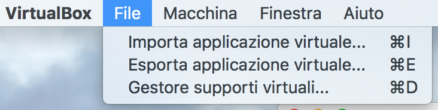
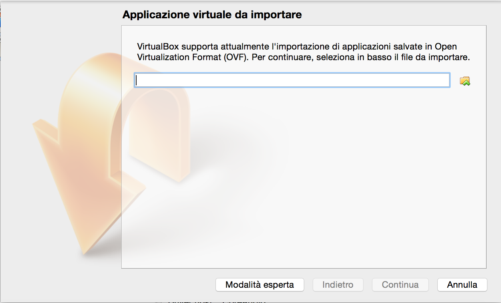
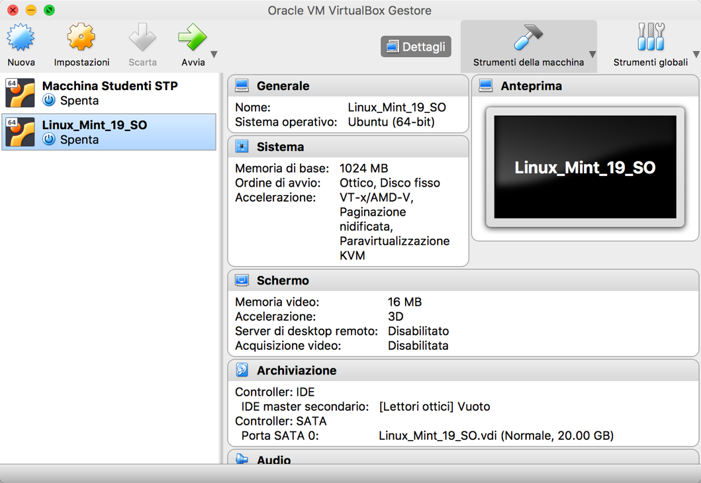
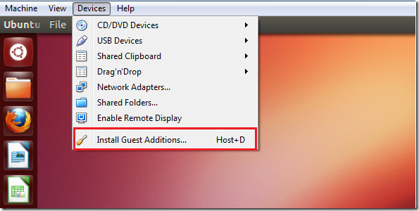
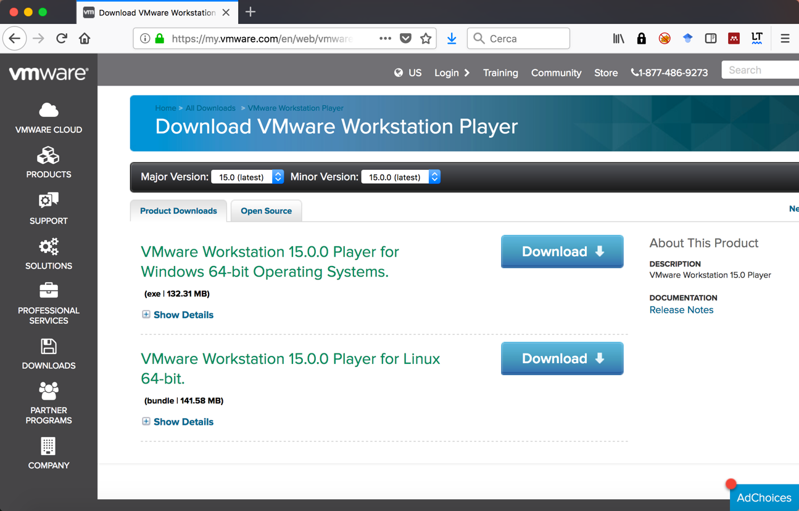
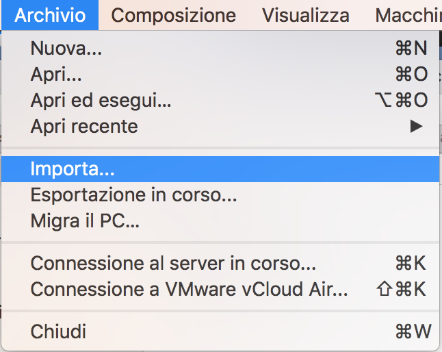
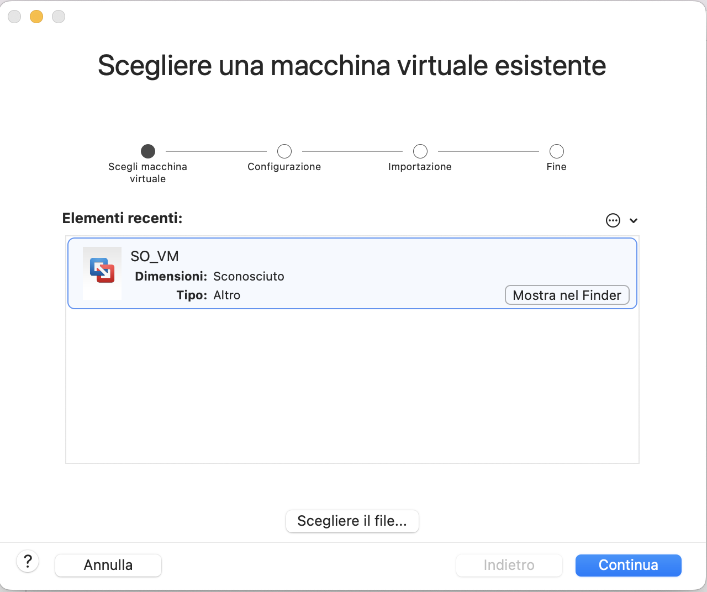
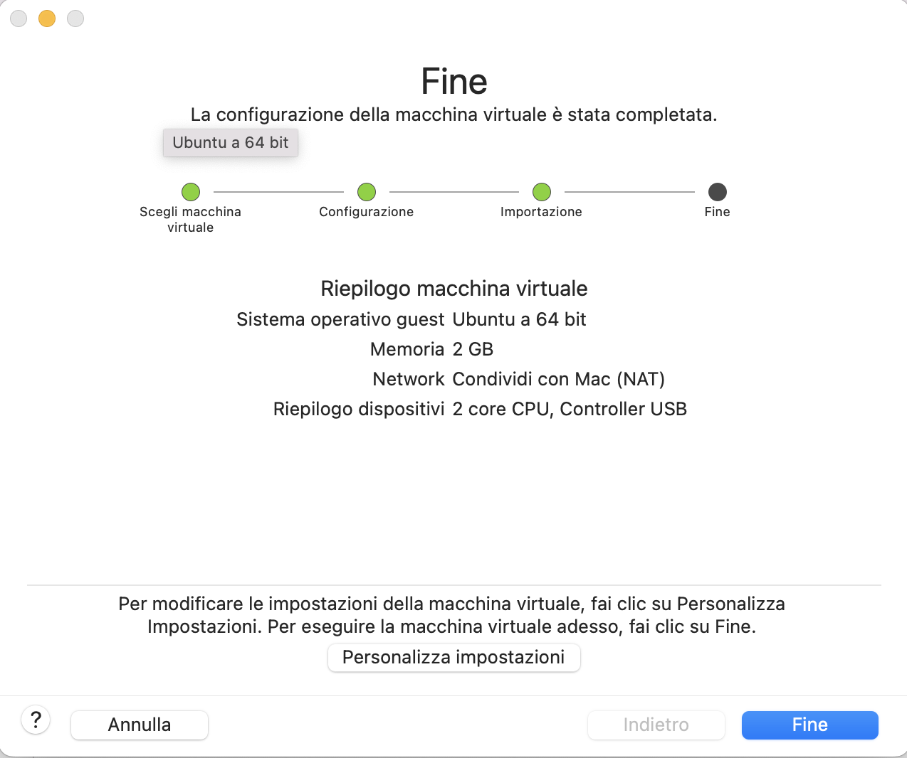
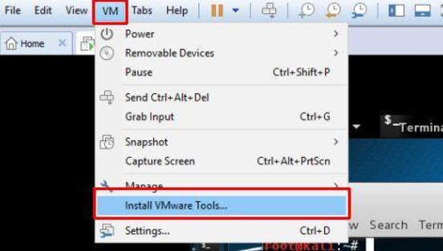

# Istruzioni per uso della macchina virtuale a supporto della parte esercitativa del corso di Sistemi Operativi

###### Docenti: Domenico Cotroneo, Marcello Cinque, Roberto Natella

**Ultimo aggiornamento: 07/10/2020**

> **_N.B.:_** Per poter eseguire una macchina virtuale è necessario abilitare le estensioni di virtualizzazione della macchina fisica. Queste estensioni vanno abilitate dal BIOS all'avvio della macchina. Seguire una guida qualsiasi in base al modello del PC.

La macchina virtuale ospita il sistema operativo **Ubuntu 20.04 LTS** (una distribuzione leggera di **Linux** ), e contiene al suo interno i principali pacchetti software utili per il corso (shell, compilatore, debugger, etc.). L'username e password dell'utente di default sono rispettivamente **so** e **so**.

La macchina è contenuta in un file con estensione **.ova** da scaricare tramite i seguenti link: 

- [LINK1](https://communitystudentiunina-my.sharepoint.com/personal/roberto_natella_unina_it/Documents/Ubuntu-Linux-20-04-SO.ova), consigliata per macchine con hardware di più alto livello (8+ CPU fisiche, 8GB RAM)
- [LINK2](XXX), consigliata per macchine con hardware (4 CPU fisiche, 4GB RAM);

Tale file è stato creato per mezzo del programma **Oracle VirtualBox**, che deve essere installato sulla macchina su cui si intende far girare la macchina virtuale. L'applicativo VirtualBox è un gestore di macchine virtuali gratuito e facilmente installabile scaricando il programma di installazione dal sito internet della Oracle ([https://www.virtualbox.org/wiki/Downloads](https://www.virtualbox.org/wiki/Downloads)).

La versione raccomandata di VirtualBox (su cui è stata creata la macchina virtuale) è la versione **6.1**.

Una volta installato VirtualBox è possibile **importare** la macchina virtuale, scegliendo ' **File -> Importa applicazione virtuale**' come in figura:

 

Appare la seguente form dove inserire **il percorso del file .ova** con la macchina virtuale da caricare:

 

Cliccare qui per selezionare il file .ova

 

Cliccare l'icona a destra del campo di testo (il bottone evidenziato in rosso nell'immagine precedente), scegliere il file di estensione '.ova'.

 

Cliccando su **Continua** , dopo pochi minuti la macchina virtuale sarà importata in VirtualBox. La macchina virtuale apparirà a sinistra nella schermata principale di VirtualBox.

Per avviare la macchina virtuale, **cliccare sul nome della macchina virtuale** nell'elenco a sinistra, e poi sul tasto **Avvia**; in alto nella schermata. Prima di avviare la VM è possibile scegliere di personalizzare l'hardware virtuale da utilizzare cliccando sul tasto  **Impostazioni**. La raccomandazione è quella di avere almeno **2 CPU virtuali** e almeno **2Gb di memoria RAM**.

Dopo l'avvio, apparirà una nuova finestra in cui eseguirà il sistema operativo Linux. Al termine dell'avvio del sistema operativo, la macchina virtuale apparirà come segue:

 

E' possibile installare le cosiddette Guest Additions che permettono di avere tutta una serie di utilità per la macchina virtuale, ad esempio cartelle condivise tra la macchina host e la macchina virtuale, un miglior supporto al video etc. Per installarle, dal menù a tendina **Devices** selezionare **Insert Guest Additions CD Image ...** (vedi Figura)

 

In alternativa a VirtualBox, è possibile eseguire la macchina virtuale utilizzando il programma **VMware Workstation Player** (per Windows e Linux). Il programma è gratuitamente scaricabile da internet.

 

Per importare la macchina virtuale in VMware Workstation Player, si selezioni la voce **Importa...**.

 

Si aprirà una nuova finestra, in cui accorrerà scegliere il file **.ova** della macchina virtuale.

 

Nel caso dovesse apparire il seguente popup sulla verifica di conformità, selezionare l'opzione **Riprova** per forzare l'importazione.

 

L'importazione della macchina virtuale potrebbe richiedere svariati minuti, dipendentemente dalla potenza della macchine fisica ospitante.

 

Come per VirtualBox, al termine dell'operazione, è possibile scegliere di personalizzare l'hardware virtuale da utilizzare per la VM importata oppure proseguire con i valori di default. La raccomandazione è quella di avere almeno 2 CPU virtuali e almeno 2Gb di memoria RAM.

 

La macchina virtuale dovrà apparire correttamente nella libreria di VMware Workstation Player.

Anche per VMWare è possibile installare le guest additions, che sono chiamate **VMware Tools** (vedi Figura seguente).

 

> **_N.B.:_** Per effettuare operazioni di amministrazione (ad esempio, installazione di pacchetti, il comando sudo, etc.), se richiesta, si utilizzi la password ' **studente**' (nome utente: ' **studente**').
