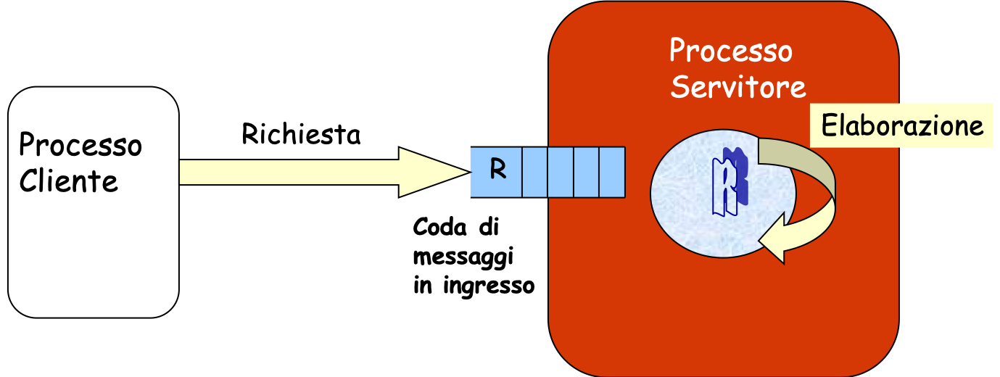

## Coda di messaggi

UNIX (System V), come anche Linux, mette a disposizione primitive che supportano la comunicazione fra processi (anche indipendenti) basata sullo **scambio di messaggi**. Un **messaggio** è identificato come un blocco di informazioni senza alcun formato predefinito.

In particolare, UNIX supporta il modello nel quale lo scambio di messaggi non avviene direttamente tra il mittente e il destinatario, ma avviene tra un utente e una **mailbox** (comunicazione indiretta).

<p align="center">

</p>

UNIX System V mette a disposizione unicamente le primitive di **send asincrona**, di **receive bloccante**, e **receive non bloccante**.

Una mailbox può essere vista come una *coda di messaggi*. Essa é caratterizzata da:

- Una chiave, come per tutte le risorse IPC (e.g., segmenti di memoria condivisa, semafori);
- Un proprietario, ovvero l’utente che la istanzia;
- Un gruppo di appartenenza;
- Un insieme di permessi di accesso, indicate dalla solita stringa con 3 numeri a 3 bit.

### Operazioni su code di messaggi

#### Creazione di una coda di messaggi: ``msgget()``

Per creare una nuova coda di messaggi, o accedere ad una esistente, bisogna invocare la system call ``msgget()``.

```c
#include <sys/types.h>       
#include <sys/ipc.h>
#include <sys/msg.h>

int msgget(key_t key, int msgflg);
```

Tale funzione restituisce l'identificativo della coda di messaggi a partire dalla chiave ``key `` (ottenuto tramite codice cablato, ``IPC_PRIVATE``, o ``ftok()``), oppure ``-1`` in caso di esito negativo. Come per le altre risorse IPC, ``msgflg `` può valere ``IPC_CREAT`` in *or logico* con i permessi se il processo chiamante deve creare la coda di messaggi, oppure ``0`` se vogliamo utilizzare una coda già istanziata.
La dimensione della coda e il numero massimo di messaggi sono decisi autonomamente dal kernel.

Assumendo di avere la funzione ``open_queue``, la sua implementazione per creare una coda di messaggi è la seguente:

```c
int open_queue( key_t keyval ){

	int qid;
        
	if((qid = msgget( keyval, IPC_CREAT | 0664 )) == -1){
		return(-1);
	}
        
	return(qid);
}
```

#### Invio di un messaggio: ``msgsnd()``

Una volta ottenuto l'identificatore unico della coda di messaggi, è possible effettuare le operazioni di invio messaggi.
Per inviare un messaggio bisogna utilizzare la system call ``msgsnd()``:

```c
#include <sys/types.h>
#include <sys/ipc.h>
#include <sys/msg.h>

int msgsnd(int msqid, const void *msgp, size_t msgsz, int msgflg);

```

Il primo parametro della ``msgsnd()`` è l'identificativo della coda di messaggi ottenuto con la ``msgget()``. Il secondo parametro, ``msgp ``, è il puntatore alla **struttura messaggio** che contiene il messaggio vero è proprio da inviare. Tale struttura è fatta come segue (N.B.: il nome della struttura può essere scelto arbitrariamente):

```c
struct msgbuf {
	long message_type;
	char message_text [MAX_SIZE];
}
```

dove:

- ``message_type`` identifica il tipo di messaggio, e deve essere sempre un intero positivo ``long``.
- ``message_text`` identifica il messaggio vero è proprio da inviare. 

Generalmente, escludendo il campo ``message_type``, lo sviluppatore può utilizzare un numero arbitrario, di qualsiasi tipo, di elementi che costituisono la struttura messaggio.

Il campo ``message_type`` diventa molto importante quando viene accoppiato con funzioni di *receive* selettive, che permettono di estrarre un particolare messaggio dalla coda della mailbox. Infatti, è possibile estrarre il messaggio il cui campo tipo contenga un valore specificato, anche se non si trova in cima.
Se ``message_type`` assume il valore del PID del processo mittente possiamo realizzare una comunicazione *indiretta simmetrica*.

Il campo ``msgsz`` rappresenta la dimensione (in byte) del messaggio, ovvero la dimensione della struttura messaggio (``msgbuf``) meno la dimensione del campo tipo (4 byte ``long``).

Il campo ``msgflg`` è un flag che ci permette di specificare la semantica dell’operazione di send. Infatti,

- Se ``msgflg == 0`` la ``msgsend ()`` blocca il processo se la mailbox è piena;
- Se ``msgflg == IPC_NOWAIT``, e la mailbox è piena, la ``msgsend ()`` ritorna ``-1`` e non accoda il messaggio

Da notare che la ``msgsnd()`` è sempre **asincrona**, tranne quando la mailbox è piena. La funzione restituisce ``0`` se non si sono verificati errori.

Un esempio di utilizzo della ``msgsend()`` è il seguente:

```c
struct message {
    long type;
    char text[25];
    int val;
} msg;

msg.type = 1;
strcpy(msg.text, "This is my first msg");
msg.val = 5;

/* send asincrona (si blocca soltanto in caso di coda piena) */

result = msgsnd(msqid, (void*)&msg, sizeof(msg) - sizeof(long), 0);

if(result<0){
	perror(”Errore nell’invio di un messaggio”);
}
```

#### Ricezione di un messaggio: ``msgrcv()``

La system call che consente la ricezione di un messaggio da una mailbox è la ``msgrcv()``:

```c
#include <sys/types.h>
#include <sys/ipc.h>
#include <sys/msg.h>

ssize_t msgrcv(int msqid, void *msgp, size_t msgsz, long msgtyp, int msgflg);
```

Tale system call permette di consumare un messaggio dalla mailbox identificata da ``msqid``. Il buffer contenente il messaggio sarà puntato da ``msgp``, e il campo messaggio di tale buffer avrà dimensione ``msgsz``.

Il campo ``msgtyp`` (tipo del messaggio) svolge importanti funzioni, infatti:

- Se ``msgtyp == 0`` viene prelevato il primo messaggio della coda (ovvero quello inviato da più tempo);
- Se ``msgtyp > 0`` viene prelevato il primo messaggio dalla coda il cui campo tipo sia pari al valore di ``msgtyp``;
- Se ``msgtyp < 0`` viene prelevato il primo messaggio dalla coda il cui campo tipo abbia una valore minore o uguale a ``|msgtyp|``.

Per il campo ``msgflg``:

- Se impostato a ``0`` indica una **ricezione bloccante**: se non ci sono messaggi da consumare nella mailbox, il processo si *sospende* sulla chiamata a ``msgrcv()`` fino al giungere del messaggio;
- Se impostato a ``IPC_NOWAIT``, ho una **ricezione non bloccante**: se non ci sono messaggi viene restituito ``-1``.

La chiamata a ``msgrcv()`` restituisce ``0`` se non si sono verificati errori.

Un esempio di utilizzo della ``msgrcv()`` è il seguente:

```c
struct message {
    long type;
    char text[25];
    int val;
} msg;

long msgtyp = 0;

/* receive bloccante */
result = msgrcv(msqid, (void *)&msg, sizeof(msg) - sizeof(long), msgtyp, 0);

if(result < 0){ 
	perror(”Errore nella ricezione di un messaggio”); 
}

printf(”Messaggio: tipo=%d, text=%s, val=%d\n”, msg.type, msg.text, msg.val);
```

#### Operazioni di controllo su una coda di messaggi: ``msgctl()``

La system call che permette di eseguire altri comandi sulla risorsa mailbox è la ``msgctl()``:

```c
#include <sys/types.h>
#include <sys/ipc.h>
#include <sys/msg.h>

int msgctl(int msqid, int cmd, struct msqid_ds *buf);
```

La chiamata a ``msgctl()`` esegue l'operazione di controllo specificata tramite ``cmd`` sulla coda di messaggi identificata da ``msqid``. In particolare, per ``cmd``:

- ``IPC_STAT``: viene effettuata una copia dalla struttura dati del kernel associata alla coda di messaggi identificata da ``msqid`` alla struttura dati ``msqid_ds`` puntata da ``buf``.

- ``IPC_SET``: permette di modificare le caratteristiche della coda 
- ``IPC_RMID``: permette di rimuovere immediatamente la coda di messaggi identificata da ``msqid``.

Per operare tramite ``msgctl()``, il processo chiamente deve avere i permessi di lettura/scrittura sulla risorsa IPC.

### Errori comuni nelle operazioni su code di messaggi

- **Mancanza del campo "tipo" nella struttura dati che rappresenta il messaggio.** 

	```c
	struct message {
   		char text[25];
	   int val;
	} msg;
	```

	È richiesto che la struttura messaggio includa **sempre** un campo "tipo", anche se non se fa uso nel programma.

- **Posizione non corretta del campo "tipo» nella struttura-messaggio.** 

	```c
	struct message {
   		char text[25];
   	 	long type;
    	int val;
	} msg;
	```

	È richiesto che il campo "tipo" sia **sempre il primo campo** all'interno della struttura messaggio, poiché il sistema operativo si aspetta di trovare nei primi byte (8 bytes per CPU a 64 bit e 4 byte per CPU a 32 bit OS) della struttura il valore del tipo di messaggio. Ad esempio, questa caratteristica è utilizzata per fare in modo che la ``msgrcv()`` riceva messaggi di un certo tipo specificato dall'utente come quarto parametro.

- **Definizione del campo "tipo" a ``long``.** 

	```c
	struct message {
		int type;
    	char text[25];
    	int val;
	} msg;
	```

	È richiesto che il campo "tipo" sia definito come ``long``. Non è corretto utilizzare un campo "tipo" definito come ``int``, poiché su alcune architetture hardware i tipi int e long sono trattati diversamente dal compilatore. Ad esempio, nei computer con CPU a 32 bit, i tipi ``int`` e ``long`` hanno spesso la stessa dimensione (4 byte), mentre nei computer con CPU a 64 bit, i tipi ``int`` e ``long`` spesso hanno, rispettivamente, una dimensione di 4 e 8 byte.

- **Campo "tipo" impostato a zero.** 

	```c
	struct message {
    	long type;
    	int val;
	} msg;

	msg.type = 0;
	msg.val = 5;

	msgsnd(msqid, (void*)&msg, sizeof(msg) - sizeof(long), 0);
	...
	```

	Il valore di tipo uguale a ``0`` è **riservato per usi speciali**, e non va utilizzato nei messaggi definiti dal programmatore. Ad esempio, nella primitiva ``msgrcv()``, il quarto parametro (``long msgtyp``) deve essere ``0`` quando si vuole che il processo possa ricevere messaggi di qualunque tipo.

- **Campo "tipo" non impostato.** In tal caso, il valore del campo tipo è imprevedibile e arbitrario (dipende dal sistema operativo, dall'hardware, e dal compilatore).

- **Errato calcolo della dimensione del messaggio.**
	Per una struttura messaggio come:
	
	```c
	struct message {
    	long type;
    	int val;
	} msg;
	```
	
	si utilizzi ``sizeof(messaggio) - sizeof(long)``

- **Errato uso di puntatori**. Ad esempio, passaggio erroneo di un "puntatore a puntatore" in input di ``msgsnd()``/``msgrcv()``.
In questo caso, il puntatore punta ad una area di memoria che non contiene una struttura messaggio, ma dati arbitrari (il contenuto dell’area puntata dal puntatore è imprevedibile). Il sistema operativo interpreta l’area puntata come se fosse una struttura-messaggio (operando un cast nel codice della chiamata di sistema): ad esempio, i primi byte dell’area puntata sono interpretati come il "campo tipo" del messaggio, e i successivi byte sono interpretati come i campi del messaggio. Poiché l’area di memoria non contiene un messaggio ma dati arbitrari, il SO legge dei campi con dei valori non corretti. Questo può causare l'invio/ricezione di messaggi dal contenuto corrotto, o il blocco delle chiamate di sistema ``msgsnd()``/``msgrcv()``.
