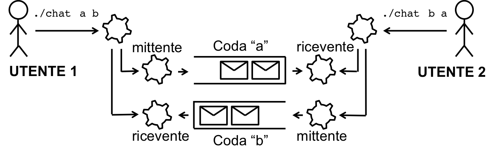

### Chat multiprocesso tramite code di messaggi

Si realizzi in linguaggio C/C++ un programma basato su code di messaggi UNIX per consentire la conversazione tra utenti del sistema. Il programma deve essere un eseguibile che due utenti (su due terminali distinti) eseguono per poter conversare. Il programma deve accettare in ingresso dalla linea di comando una coppia di caratteri da utilizzare come identificativi delle code da usare per le conversazioni[1]. Il programma dovrà istanziare una coppia di processi figli, un mittente e un ricevente:

- Il processo figlio mittente eseguirà un loop in cui ad ogni iterazione si mette in attesa di una stringa dall'utente dallo standard input[2], ed invia un messaggio con la stringa sulla prima coda di messaggi condivisa. Quando l'utente inserisce "exit" seguito da un carattere di invio, il programma deve inviare un messaggio con una stringa "exit" sulla seconda coda e terminare.
- Il processo figlio ricevente eseguirà un loop in cui ad ogni iterazione si metterà in attesa di un messaggio dalla seconda coda, e stamperà sullo standard output la stringa ricevuta. In caso di ricezione di un messaggio con la stringa "exit", il processo dovrà terminare. Si verifichi la correttezza del programma simulando 2 coppie di utenti che conversano, avviando 2 coppie di istanze del programma su 4 terminali diversi.

[1]: In altri termini, se un mittente ed un ricevente usano gli stessi caratteri di ingresso, essi devono poter comunicare tra loro usando le stesse code di messaggi condivise. Se invece un mittente e un ricevente usano caratteri di ingresso diversi, essi useranno code diverse e non potranno comunicare tra loro.

[2]: Si utilizzi la funzione scanf() per leggere una stringa dallo standard input.
