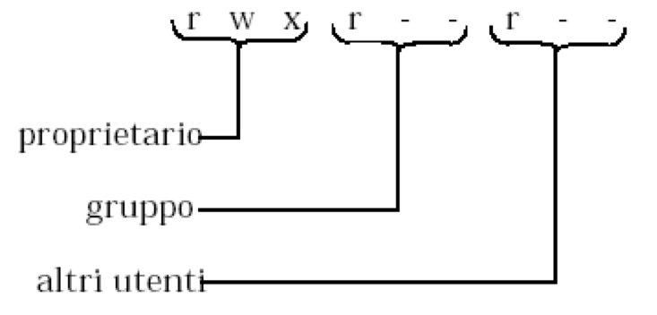

# Comandi di base

## Il comando ``sudo``

``sudo`` è un'applicazione che permette di eseguire i comandi con gli stessi privilegi dell'utente di root (l'utente più privilegiato). E.g.:

```console
$ sudo COMANDO
```

## Installazione pacchetti

In Ubuntu, il package manager a linea di comando è l'applicazione ``apt``

Per poter installare i manuali per le librerie basate su POSIX (e.g., IPC, etc.), e installare tutti gli applicativi di sistema (e.g., make, gcc, etc.), eseguire i seguenti comandi con ``sudo``:

```console
sudo apt-get install manpages-posix
sudo apt-get install manpages-posix-dev
sudo apt-get install build-essential
```

## Documentazione comandi: il comando ``man``

Per poter visualizzare la documentazione di uno specifico comando, possiamo utilizzare il comando ``man`` che prende in ingresso come primo parametro il comando di cui vogliamo la documentazione. E.g.:

```console
$ man ls

LS(1)							   User Commands                                 LS(1)

NAME
       ls - list directory contents

SYNOPSIS
       ls [OPTION]... [FILE]...

DESCRIPTION
       List information about the FILEs (the current directory by default).
       Sort entries alphabetically if none of -cftuvSUX nor --sort is specified.

       Mandatory arguments to long options are mandatory for short options too.

       -a, --all
              do not ignore entries starting with .

       -A, --almost-all
              do not list implied . and ..
              
...
```


## Percorso relativo e percorso assoluto

Il **percorso assoluto** indica come giungere ad un file partendo dalla directory radice ``/``. E.g., un path assoluto è del tipo ``/home/user/main.c``.

Un **percorso relativo** fa riferimento alla directory corrente. Il comando per ottenere la directory corrente è ``pwd``:

```console
$ pwd
/home/so
```

## Lista di file e directory

Per ottenere la lista di file e directory, è possibile utilizzare il comando ``ls``:

```console
$ ls
Documenti  echo_test  echo_test_sort  Immagini  Modelli  Musica  prova  prova.c  Pubblici  Scaricati  Scrivania  snap  Video
```

Per ottenere una lista più dettagliata, visualizzando i permessi, e anche la grandezza di ogni file e directory, è possibile utilizzare il comando ``ls -lah``:

```console
$ ls -lah
totale 128K
drwxr-xr-x 19 so   so   4,0K ott  7 13:37 .
drwxr-xr-x  3 root root 4,0K set 27 18:57 ..
drwxr-xr-x  2 so   so   4,0K set 27 19:09 Documenti
-rw-rw-r--  1 so   so     24 ott  7 13:34 echo_test
-rw-rw-r--  1 so   so     24 ott  7 13:38 echo_test_sort
drwxr-xr-x  2 so   so   4,0K set 27 19:09 Immagini
drwxr-xr-x  2 so   so   4,0K set 27 19:09 Modelli
drwxr-xr-x  2 so   so   4,0K set 27 19:09 Musica
-rwxrwxr-x  1 so   so    17K ott  7 13:07 prova
-rw-rw-r--  1 so   so     74 ott  7 13:06 prova.c
drwxr-xr-x  2 so   so   4,0K set 27 19:09 Pubblici
drwxr-xr-x  2 so   so   4,0K set 27 19:09 Scaricati
drwxr-xr-x  2 so   so   4,0K set 27 19:09 Scrivania
drwxr-xr-x  2 so   so   4,0K set 27 19:09 Video
```

> **_N.B.:_** La dimensione delle directory **non** è la somma delle dimensioni dei file contenuti. In realtà, è la dimensione del **descrittore** di quella directory (il descrittore della directory è un file!), che di default è 4Kb.


## Utilizzo delle directory

- Entrare in una directory

```console
$ ls
Documenti  echo_test  echo_test_sort  Immagini  Modelli  Musica  prova  prova.c  Pubblici  Scaricati  Scrivania  snap  Video
$ cd Documenti/
~/Documenti$ pwd
/home/so/Documenti
```

- Creare una directory

```console
$ mkdir new_directory

```

## Permessi

Ogni file e directory in Linux hanno un insieme di permessi definiti attraverso una maschera di 9 bit.

<p align="center">
 
</p>

<p align="center">
 
</p>

E' possibile visualizzare i permessi di una data directory o file attraverso il comando ``ls -l``:

```console
$ ls -l
totale 68
drwxr-xr-x 2 so so  4096 set 27 19:09 Documenti
-rw-rw-r-- 1 so so    24 ott  7 13:34 echo_test
-rw-rw-r-- 1 so so    24 ott  7 13:38 echo_test_sort
drwxr-xr-x 2 so so  4096 set 27 19:09 Immagini
drwxr-xr-x 2 so so  4096 set 27 19:09 Modelli
drwxr-xr-x 2 so so  4096 set 27 19:09 Musica
-rwxrwxr-x 1 so so 16688 ott  7 13:07 prova
-rw-rw-r-- 1 so so    74 ott  7 13:06 prova.c
drwxr-xr-x 2 so so  4096 set 27 19:09 Pubblici
drwxr-xr-x 2 so so  4096 set 27 19:09 Scaricati
drwxr-xr-x 2 so so  4096 set 27 19:09 Scrivania
drwxr-xr-x 5 so so  4096 set 27 19:41 snap
drwxr-xr-x 2 so so  4096 set 27 19:09 Video
```

Oltre ai 9 bit che rappresentano i permessi, viene utilizzato un ulteriore carattere (il primo) che identifica:

- ``-``: Regular file
- ``b``: Block special file
- ``c``: Character special file
- ``d``: Directory
- ``l``: Symbolic link
- ``n``: Network file
- ``p``: FIFO
- ``s``: Socket

E' possibile modificare i permessi di un file/directory attraverso il comando ``chmod``. E.g.:

Rimuovere il permesso di esecuzione ad un file di nome ``prova``:

```console
$ chmod -x prova
```

Aggiungere il permesso di esecuzione ad un file di nome ``prova``:

```console
$ chmod +x prova
```

## Copia, rinomina, e rimozione file

- Copia il file specificato come primo parametro nel file specificato come secondo parametro

```console
$ cp file_sorgente file_destinazione
```

- Rinomina il file specificato come primo parametro nel file specificato come secondo parametro

```console
$ mv file_sorgente file_destinazione
```

- Sposta il file specificato come primo parametro nella directory specificata come secondo parametro

```console
$ mv file_sorgente directory_dest/
```

- Rimuovi il file specificato come primo parametro

```console
$ rm file_target
```

- Rimuovi la directory specificata come primo parametro

```console
$ rm -r directory_target
```


## Compilazione ed esecuzione di programmi

Supponiamo di aver creato un file ``prova.c`` con il seguente snippet di codice:


```c
#include <stdio.h>

int main(){


	printf("HELLO WORLD!\n");
	return 0;
}
```

Per compilare il file sorgente e ottenere un file eseguibile (che chiamiamo ``prova``):

```console
$ gcc -o prova prova.c 
```

Per poter lanciare l'eseguibile possiamo utilizzare un percorso relativo o assoluto.

Utilizzando il percorso assoluto:

```console
$ /home/so/prova 
HELLO WORLD!
```

Utilizzando il percorso relativo:

```console
$ pwd
/home/so
$ ./prova 
HELLO WORLD!
```

# Comandi avanzati

## Il comando ``echo`` e ``cat``

Il comando ``echo`` mostra la stringa in input come primo parametro sull stdout (di default è il video). E.g.:

```console
$ echo "HELLO WORLD!"
HELLO WORLD!
```

Il comando ``cat`` mostra il file in input come primo parametro sull stdout (di default è il video). E.g.:

```console
$ cat prova.c
#include <stdio.h>

int main(){


	printf("HELLO WORLD!\n");
	return 0;
}
```


## Redirezione su file: gli operatori ``>`` e ``>>``

Gli operatori di redirezione su file permettono di riversare su file l'output di qualsivoglia comando. E.g., per poter redirigere l'output del comando ``echo`` sul file di nome ``nomefile`` è possibile eseguire:

```console
$ echo "messaggio1" > nomefile
$ cat nomefile
messaggio1
```
> **_N.B.:_** Il file ``nomefile`` viene ogni volta ricreato!

Per poter aggiungere righe ad un file già esistente è possibile utilizzare l'operatore ``>>``. E.g.:

```console
$ echo "messaggio2" >> nomefile
$ cat nomefile
messaggio1
messaggio2
```

## L'operatore *pipe* ``|``

L'operatore **pipe** ``|`` impone alla shell di connettere fra loro 2 o più comandi: ``cmd1 | cmd2 | ... | cmdN``. La shell creerà un file temporaneo di tipo pipe (invisibile all'utente) e redirige lo stdout del primo comando (``cmd1``) sulla pipe, ovvero creerà un processo che esegue il comando ``cmd1`` redirigendo l'output sullo stdin del ``cmd2``, e così via.

L'operatore **pipe** è utile quando si vuole creare dei filtri o per visualizzare e manipolare i risultati in un programma interattivo.
Ad esempio, supponiamo di voler scrivere un file che contenga l'ordinamento alfanumerico delle righe di un secondo file. A tale scopo è possibile utilizzare in **pipe** il comando ``cat`` e il comando ``sort``:

```console
$ cat nomefile
3
2
1
$ cat nomefile | sort
1
2
3
$ cat nomefile | sort >> nomefile_sorted
$ cat nomefile_sorted
1
2
3
```

## Comandi di utilità per i processi: ``ps`` e ``top``

Il comando ``ps`` permette di ottenere una istantanea dei processi/thread nel sistema. Per visualizzare tutti i processi nel sistema utilizzando la sintassi BSD, eseguire:

```
$ ps aux
USER         PID %CPU %MEM    VSZ   RSS TTY      STAT START   TIME COMMAND
root           1  0.1  0.6 169140 12640 ?        Ss   16:03   0:09 /sbin/init splash
root           2  0.0  0.0      0     0 ?        S    16:03   0:00 [kthreadd]
root           3  0.0  0.0      0     0 ?        I<   16:03   0:00 [rcu_gp]
root           4  0.0  0.0      0     0 ?        I<   16:03   0:00 [rcu_par_gp]
root           6  0.0  0.0      0     0 ?        I<   16:03   0:00 [kworker/0:0H-kblockd]
root           9  0.0  0.0      0     0 ?        I<   16:03   0:00 [mm_percpu_wq]
root          10  0.0  0.0      0     0 ?        S    16:03   0:02 [ksoftirqd/0]
root          11  0.0  0.0      0     0 ?        I    16:03   0:03 [rcu_sched]
root          12  0.0  0.0      0     0 ?        S    16:03   0:00 [migration/0]
root          13  0.0  0.0      0     0 ?        S    16:03   0:00 [idle_inject/0]
root          14  0.0  0.0      0     0 ?        S    16:03   0:00 [cpuhp/0]

...

root       11251  0.0  0.0      0     0 ?        I    18:30   0:00 [kworker/0:3-events]
root       11252  0.0  0.0      0     0 ?        I    18:30   0:00 [kworker/0:4]
so         11260  0.0  0.1  11492  3280 pts/0    R+   18:31   0:00 ps aux
```

Notare le diverse colonne visualizzate nel terminale:

- **PID** mostra il Process ID del processo che esegue il comando specificato nella colonna **COMMAND**;
- **%CPU** e **%MEM** mostrano rispettivamente la percentuale di utilizzo di CPU e memoria RAM;
- **STAT** mostra lo stato del processo. Alcuni flag interessanti sono:
	- ``R`` in esecuzione o pronto per eseguire;
	- ``S`` bloccato (in attesa di un evento per completare l'esecuzione);
	- ``T`` terminato, prematuramente o naturalmente.

Da notare che anche il comando ``ps aux`` che abbiamo appena lanciato rientra tra i processi in esecuzione (ultima riga dello snippet precedente). Ovviamente, una volta prodotto l'output richiesto, il processo termina.

Il comando ``top`` è un altra utilità per avere una vista dei processi che attualmente sono nel sistema. A differenza di ``ps``, il comando ``top`` mostra però una vista real-time dinamica dei processi, aggiungedo un *summary* delle informazioni di sistema, e.g., l'uso corrente del tempo di CPU e della RAM di sistema e l'utilizzo dell'area di swap.

```console
top - 18:49:39 up  2:45,  1 user,  load average: 0,10, 0,04, 0,01
Tasks: 261 total,   1 running, 260 sleeping,   0 stopped,   0 zombie
%Cpu(s):  5,6 us,  3,7 sy,  0,0 ni, 90,7 id,  0,0 wa,  0,0 hi,  0,0 si,  0,0 st
MiB Mem :   1987,7 total,    335,1 free,    882,6 used,    770,0 buff/cache
MiB Swap:   1873,4 total,   1846,0 free,     27,4 used.    929,6 avail Mem

    PID USER      PR  NI    VIRT    RES    SHR S  %CPU  %MEM     TIME+ COMMAND
   3043 so        20   0 3696400 329200  74196 S   2,3  16,2   1:47.89 gnome-shell
   2859 so        20   0  246496  54476  25480 S   2,0   2,7   0:52.58 Xorg
   6235 so        20   0  818080  50500  36700 S   1,3   2,5   0:24.83 gnome-terminal-
      1 root      20   0  169140  12640   8332 S   0,0   0,6   0:09.17 systemd
      2 root      20   0       0      0      0 S   0,0   0,0   0:00.02 kthreadd
      3 root       0 -20       0      0      0 I   0,0   0,0   0:00.00 rcu_gp
      4 root       0 -20       0      0      0 I   0,0   0,0   0:00.00 rcu_par_gp
      6 root       0 -20       0      0      0 I   0,0   0,0   0:00.00 kworker/0:0H-kblockd
      9 root       0 -20       0      0      0 I   0,0   0,0   0:00.00 mm_percpu_wq
     10 root      20   0       0      0      0 S   0,0   0,0   0:02.37 ksoftirqd/0
     11 root      20   0       0      0      0 I   0,0   0,0   0:03.41 rcu_sched
...

> **_N.B.:_** Il programma ``top`` termina quando si digita il carattere ``q``.
