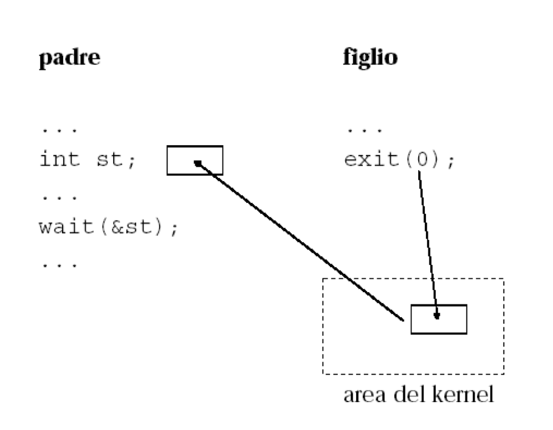

## Creazione di un processo: la ``fork()``

La creazione di nuovi processi è gestita mediante la seguente chiamata di sistema:

```	c
pid_t fork(void);
```

La ``fork()`` crea una copia **esatta** (duplicazione) del processo chiamante. Il nuovo processo viene chiamato *figlio* (child), mentre il processo chiamante è detto *padre* (father). Le aree dati globali, stack, heap e U-area sono copiate da padre e figlio, e i due processi eseguono in spazi di memoria completamente separati. Pertanto:

- Il figlio eredita gli stessi valori delle variabili, i descrittori agli stessi file aperti, e anche il Program Counter (PC);
- Le modifiche apportate alle proprie variabili da uno dei due processi _non_ sono visibili all’altro.

Padre e figlio condivideranno l’area testo.

Siccome viene copiato anche il PC, processo padre e processo figlio riprenderanno l’esecuzione dal punto in cui è stata eseguita la ``fork()``. 

La ``fork()`` restituisce un valore intero che viene utilizzato per discriminare se si è nel contesto di esecuzione del processo padre o del processo figlio. In particolare:

- Se la ``fork()`` ha successo, il PID del processo *figlio* viene restituito nel contesto di esecuzione del processo *padre*, mentre viene restiuto ``0`` nel contesto di esecuzione del processo *figlio*;
- Se la ``fork()`` fallisce, ad esempio, perchè non c'è abbastanza memoria RAM da allocare per il processo da creare, viene restituito il valore ``-1``.

E' possibile approfondire il funzionamento della ``fork()`` analizzando il manuale (``man fork``).

Secondo quanto detto fin'ora, l'utilizzo corretto della ``fork()`` è il seguente:

```c
pid = fork();
 
// Controllo che non è fallita la chiamata
if (pid == -1) { 
	fprintf(stderr, "fork failed\n"); 
	exit(1); 
} 

// Scrivo il codice inerente al processo figlio
if (pid == 0) { 
	printf(“This is the child\n"); 
	// Aggiungere altro
	exit(0); 
} 

// Scrivo il codice inerente al processo padre
if (pid > 0) { 
	printf(“This is parent. The child is %d\n", pid); 
	// Aggiungere altro
	exit(0); 
}
```

### Creazione di *N* processi

Per creare *N* processi è necessario richiamare la system call ``fork()`` *N* volte, imponendo che il solo processo padre possa creare ulteriori processi figli!

La soluzione classica **sbagliata** è la seguente:

```c
int i, pid, N=3;
for (i=0; i<N; i++){
	pid = fork();
	printf("Sono il FIGLIO con PID: %d\n", getpid());
}
```

Assumendo ``N=3``, tale codice non creerà 3 processi figli, ma ogni volta che si richiamerà la ``fork()`` il processo figlio appena creato avrà il proprio flusso di controllo, e dipendentemente dal valore di ``i`` potrà creare altri processi figli a sua volta (questo è alla base del famoso attacco informatico [fork bomb](https://en.wikipedia.org/wiki/Fork_bomb))!

La soluzione corretta è:

```c
int i, pid, N=3;
for (i=0; i<N; i++){
	pid = fork();
	if (pid == 0){
		printf("Sono il FIGLIO con PID: %d\n", getpid());
		i=3;
	}
}
```

Analizzare il codice [main.c](main.c), provando ad eseguire il codice commentando e decommentando la [riga 13](main.c#L13).


## Attesa e terminazione di un processo

### ``wait()``

Per poter consentire ad un processo padre di raccogliere l’eventuale stato di terminazione dei figli è possibile utilizzare la system call ``wait()``. La firma della funzione è la seguente:

```c
pid_t wait(int *wstatus);
```

La system call ``wait()`` sospende l'esecuzione del processo chiamante fino a che uno dei suoi processi figli termina. Essa restituisce il PID del processo figlio che è terminato; se non esistono figli, o in caso di errore viene restituito l'intero ``–1``.

Se il valore di ``wstatus`` è non nullo (``NULL``), la funzione ``wait()`` memorizza nel valore intero puntato da tale variabile le informazioni sullo stato del processo. Questo valore può essere analizzato utilizzando diverse macro, come ad esempio ``WIFEXITED(wstatus)`` che restituisce il valore booleano ``true`` se il processo figlio è terminato normalmente, attraverso la chiamata ad ``exit()`` o dal return dal ``main()``.

Inoltre, la variabile ``wstatus`` contiene il valore passato dal processo figlio alla system call ``exit()``
Ci sono alcuni casi da considerare:

- Se un processo è terminato ma il suo genitore non ha ancora atteso (wait) la sua fine, il processo terminato viene definito processo **zombie**. In tal caso il kernel rilascia tutte le risorse di tale processo tranne il suo stato di terminazione, per dargli la possibilità di ricongiungersi con il padre (wait).

- Se il processo genitore termina prima dei suoi processi figli, attivi o zombie, tali processi sono detti **orfani**. In tal caso Unix assegna all’ID del processo padre il valore ``1``, cioè diventano figli del processo init (che non termina mai). I figli non sono consapevoli della terminazione del processo padre.

### ``exit()``

Un processo termina con la chiamata di sistema ``exit()``. La firma è la seguente:

```c
void exit(int status);
```

Quando la ``exit()`` viene invocata, uno stato di uscita con valore intero viene passato dal processo al kernel. Tale valore è disponibile al processo padre attraverso la chiamata di sistema ``wait()``. Un processo che termina normalmente restituisce uno stato di uscita pari a ``0``.

In particolare, lo stato di terminazione di un processo è un intero a 16 bit. Nel byte meno significativo vengono indicate informazioni relative a come il figlio è terminato, e più precisamente:

- ``0``: volontariamente;
- <span>&#8800;</span> ``0``: involontariamente (il valore esprime il segnale ricevuto).

Nel caso in cui il figlio termini volontariamente, il byte più significativo contiene lo stato di terminazione (il valore del parametro attuale passato alla ``exit()``, ``0`` nell’esempio in figura).  

<p align="center">
 
</p>

